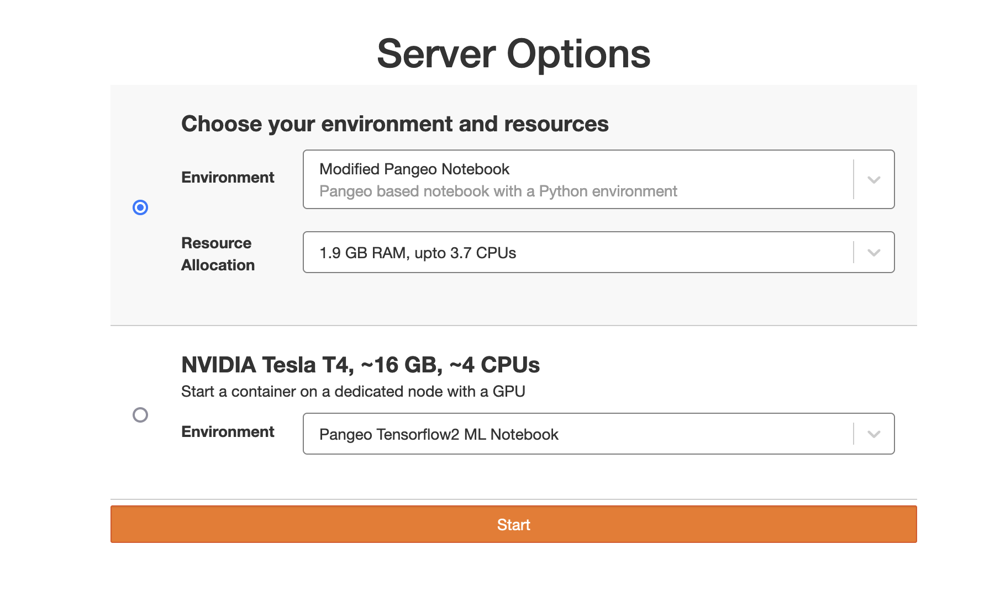

---
site:
  hide_outline: true
---
# Jupyterhub fancy profiles


+++ { "kind": "split-image", "class": "col-page-inset-right" }

### A modern, React-based profile selector for JupyterHub

A beautiful, feature-rich implementation of user-selectable profiles for JupyterHub with KubeSpawner.

{button}`Install <install.md>` {button}`User guide <guide.md>`



+++

## Key features

::::{grid} 1 1 2 2

:::{card} ✅ Enhanced profile selection
Renders your [KubeSpawner `profileList`](https://z2jh.jupyter.org/en/latest/jupyterhub/customizing/user-environment.html#using-multiple-profiles-to-let-users-select-their-environment) with a better looking and more featureful interface, including descriptions for various options.
:::

:::{card} ✨ Better user interface
Uses React and modern web design components for an attractive interface.
:::

:::{card} ⚗️ Dynamic image building
When enabled, integrates with BinderHub (deployed as a JupyterHub service) to allow users to [dynamically build images](#dynamic-image-building).
:::

:::{card} ⚙️ Standard KubeSpawner config
Works with your existing KubeSpawner configuration, no need to change how you define profiles.
:::

:::{card} 🔗 Auto-start permalinks
Generate shareable URLs that automatically launch servers with pre-configured options, perfect for workshops, courses, or shared environments.
:::

::::

---

## Quick start

::::{grid} 1 1 2 2

:::{card} 🚀 Install
:link: install

Get started with z2jh or KubeSpawner
:::

:::{card} 📖 User Guide
:link: guide

Configure profiles and features
:::

:::{card} 💻 Developer Guide
:link: develop

Contribute and extend the project
:::

:::{card} GitHub
:link: https://github.com/2i2c-org/jupyterhub-fancy-profiles

View source and report issues
:::

::::

---

## Who is this for?

**JupyterHub Administrators** who want to provide a better user experience when offering multiple server environments, resource options, or dynamic image building capabilities.

**Common Use Cases**:
- Research institutions offering various pre-configured environments
- Educational platforms with different course-specific setups
- Organizations letting users customize their computational resources
- Deployments integrating dynamic image building from repositories

---

## Auto-start feature

The auto-start feature allows you to create shareable URLs that automatically launch a JupyterHub server with pre-configured settings. This is particularly useful for:

- **Workshops and tutorials**: Provide participants with a link that starts their environment with the exact configuration needed
- **Course materials**: Embed links in course content that launch students directly into the right environment
- **Shared environments**: Create standardized setups for teams or projects

### How it works

1. Configure your desired server options in the profile form (profile type, image, resources, etc.)
2. Click the "Copy Link" button to copy a permalink to your clipboard
3. The copied URL includes `autoStart=false` by default, change this to `autoStart=true` in the URL to enable automatic launching
4. Share the URL with others or bookmark it for yourself

When someone visits a URL with `autoStart=true`, the form will automatically populate with the saved configuration and submit itself after a brief timeout, launching the server immediately.

```{tip}
The permalink button automatically sets `autoStart=false` to make it easy to create auto-start URLs. Simply change `false` to `true` in the copied URL to enable the auto-start behavior.
```

### Advanced: Combining with nbgitpuller URLs

If your JupyterHub environment has [nbgitpuller](https://github.com/jupyterhub/nbgitpuller) installed, you can combine auto-start permalinks with git-pull functionality to create URLs that both clone a repository and launch a pre-configured server. The nbgitpuller extension enables the `/hub/user-redirect/git-pull` URLs and automatically handles login redirects.

This is especially useful for distributing workshop materials or course notebooks where you want participants to have both the right environment and the right content.

Here's a Python script that generates such URLs:

```python
import urllib.parse
import re

# Configuration
notebook_url = "https://github.com/org/repo/blob/branch/notebooks/example.ipynb"
permalink = ""  # Permalink copied from fancy profiles form
jupyterhub_url = "https://jupyterhub.example.org"

# Extract repository information from notebook URL
git_repo_url = notebook_url.split("/blob/")[0]
branch = notebook_url.split("/blob/")[1].split("/")[0]
notebook_path = "/".join(notebook_url.split("/blob/")[1].split("/")[1:])
notebook_suburl = git_repo_url.split("/")[-1] + "/" + notebook_path

# Build git-pull URL (requires nbgitpuller)
gitpull_next = (
    f"/hub/user-redirect/git-pull"
    f"?repo={git_repo_url}"
    f"&branch={branch}"
    f"&urlpath=lab/tree/{notebook_suburl}"
)

# Build spawn URL with git-pull as next parameter
spawn_next = "/hub/spawn?next=" + urllib.parse.quote(gitpull_next, safe="")

# Extract fancy-forms-config from permalink and enable auto-start
config_match = re.search(r"%23.+?(?=%7D)", permalink)
if config_match:
    fancy_forms_config = config_match[0].replace(
        "%22autoStart%22%3A%22false%22",
        "%22autoStart%22%3A%22true%22"
    )
    # Construct final URL
    final_url = (
        f"{jupyterhub_url}/hub/login"
        f"?next={urllib.parse.quote(spawn_next, safe='')}"
        f"{fancy_forms_config}%7D"
    )
    print(final_url)
else:
    print("Error: Could not extract config from permalink")
```

**How it works:**

1. The script extracts the git repository URL and branch from a GitHub notebook URL
2. It creates a git-pull URL that clones the repository and opens the specified notebook (enabled by nbgitpuller)
3. It combines this with the fancy profiles configuration from your permalink
4. It sets `autoStart=true` to automatically launch the server
5. The nbgitpuller extension handles the login redirect flow automatically
6. The result is a single URL that authenticates users, clones the repository, configures the server environment, and launches it automatically

```{note}
This requires [nbgitpuller](https://github.com/jupyterhub/nbgitpuller) to be installed in your JupyterHub environment. nbgitpuller provides the `/hub/user-redirect/git-pull` endpoint and handles the authentication redirect flow.
```

**Example use case:** Share a link with workshop participants that gives them the right computational environment and opens the workshop notebook automatically.

---

## Compatibility

```{note}
**JupyterHub Version**

Version 0.4.0+ requires **JupyterHub 5 or higher**. If you're using an older version of JupyterHub, use version 0.3.x.
```

---

## Acknowledgments

Funded in part by [GESIS](http://notebooks.gesis.org) in cooperation with NFDI4DS [460234259](https://gepris.dfg.de/gepris/projekt/460234259) and [CESSDA](https://www.cessda.eu).
